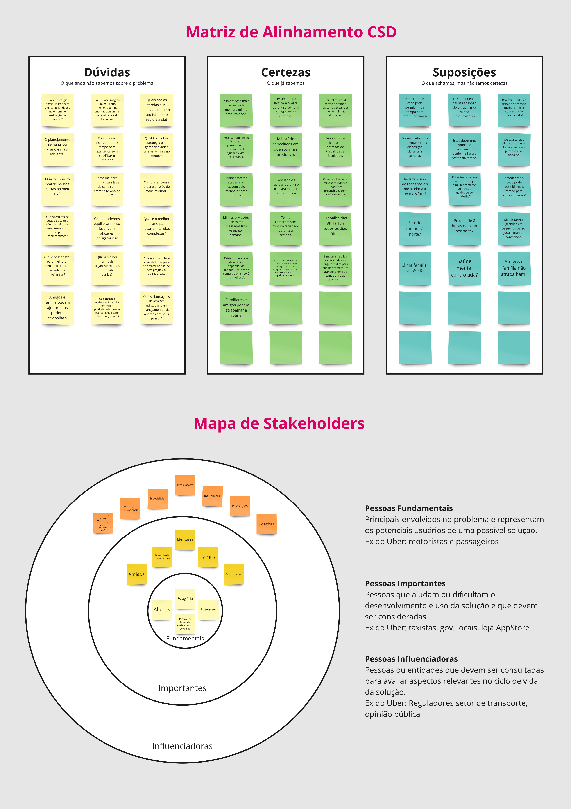
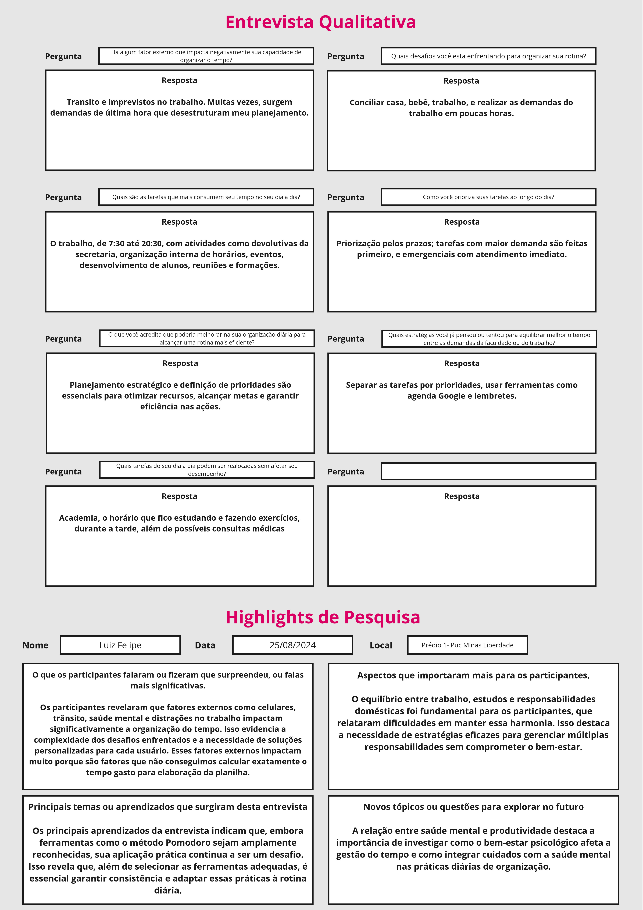
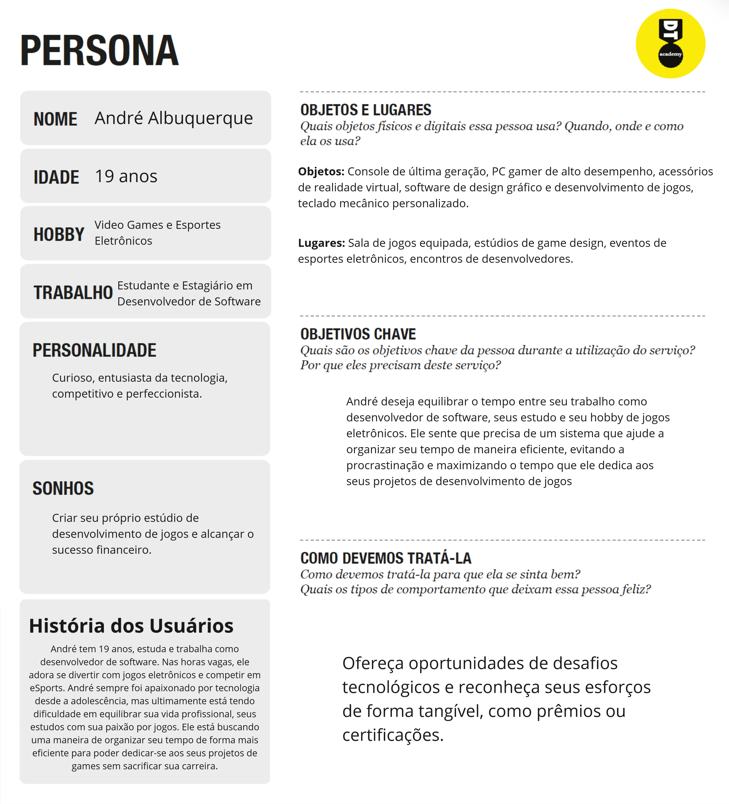
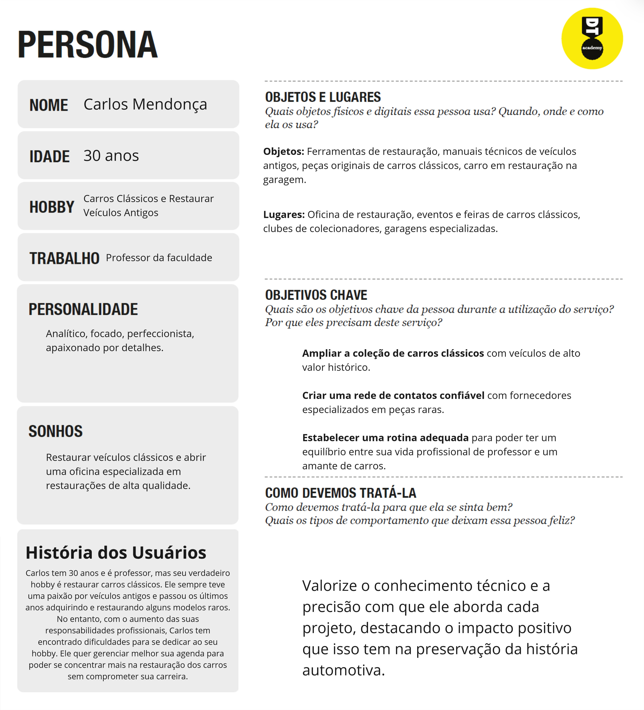
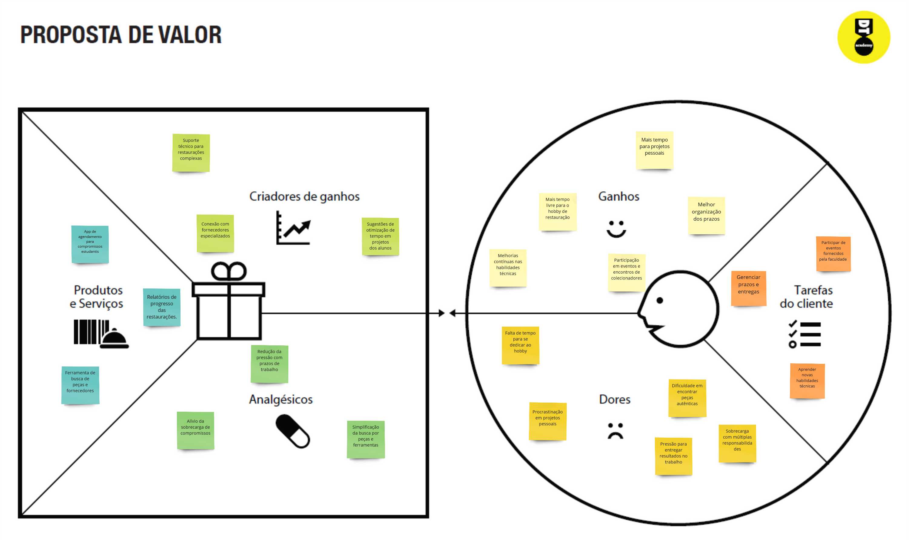
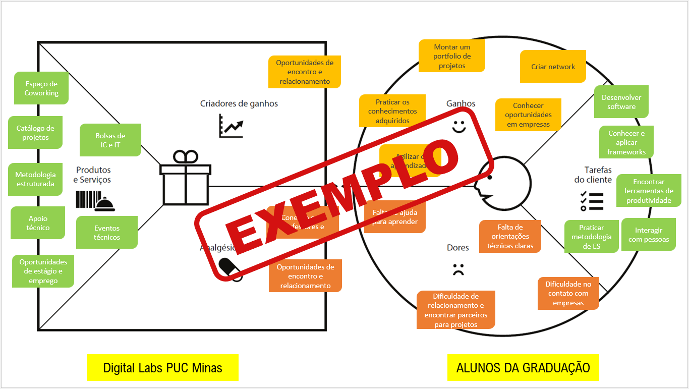
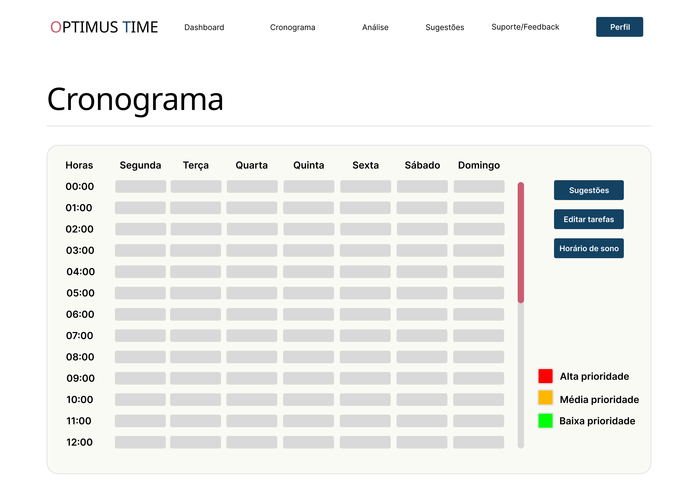
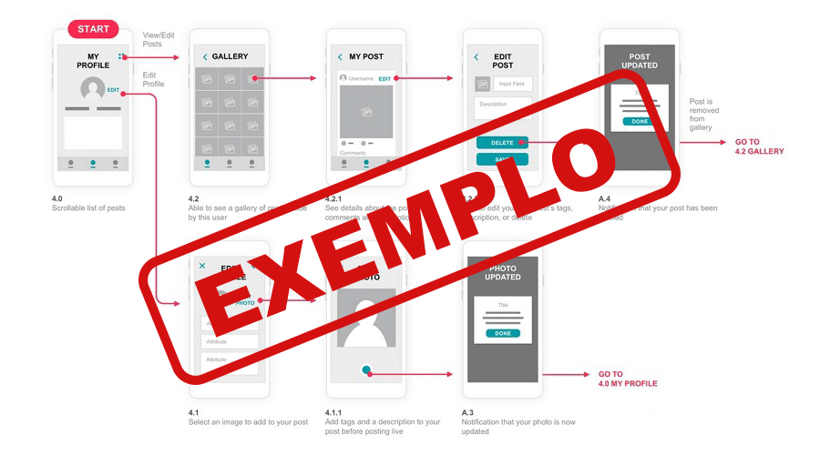
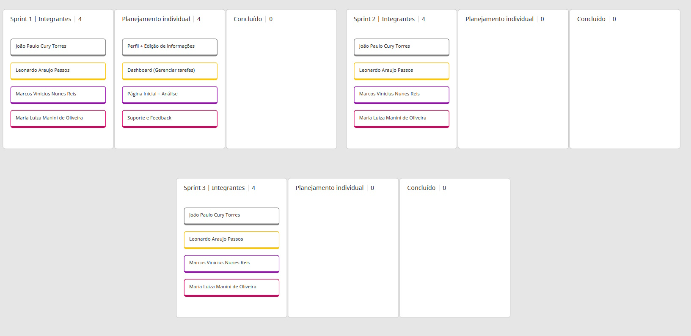

# Introdução

Informações básicas do projeto.

<<<<<<< HEAD
* **Projeto:** Optimus Time
* **Repositório GitHub:** [ti-1-ppl-cc-m-2024-2-g15-dificuldade-em-otimizar-o-tempo-2](https://github.com/ICEI-PUC-Minas-PPLCC-TI/ti-1-ppl-cc-m-2024-2-g15-dificuldade-em-otimizar-o-tempo-2)
* **Membros da equipe:**

  * [Leonardo Araújo Passos](https://github.com/LeoPassos98)
  * [Marcos Vinícius Nunes Reis](https://github.com/marcosware)
  * [Maria Luíza Manini de Oliveira](https://github.com/malumanini)
=======
* **Projeto:** [NOME DO PROJETO]
* **Repositório GitHub:** [LINK PARA O REPOSITÓRIO NO GITHUB]
* **Membros da equipe:**

  * [Fulano](https://github.com/fulano) ⚠️ EXEMPLO ⚠️
  * [Beltrano](https://github.com/beltrano) ⚠️ EXEMPLO ⚠️
  * [Cicrano](https://github.com/cicrano) ⚠️ EXEMPLO ⚠️
>>>>>>> 28203ff32e6dba5528cca7a3a34f7689df1c5f57

A documentação do projeto é estruturada da seguinte forma:

1. Introdução
2. Contexto
3. Product Discovery
4. Product Design
5. Metodologia
6. Solução
7. Referências Bibliográficas

<<<<<<< HEAD
✅ [Documentação de Design Thinking (MIRO)](files/processo-dt-G5.pdf)

# Contexto

Você provavelmente já sentiu que estava afogado de afazeres alguma vez na vida, não é? E com os dispositivos eletrônicos, redes sociais e seus emergentes vídeos curtos, a falta de instruções e uma rotina pesada faz com que você não seja o único sofrendo disso.

Muitas pessoas enfrentam dificuldades para otimizar o tempo devido à sobrecarga de tarefas, falta de planejamento e distrações. E nos últimos tempos, isso vem ficando cada vez mais difícil com o quão fácil os dispositivos eletrônicos estão facilmente em nosso alcance, permitindo que nos distraímos. Isso pode causar atrasos na rotina e uma sensação de improdutividade, sendo essencial o uso de métodos para gerenciar e otimizar o tempo, priorizar atividades e alcançar um equilíbrio entre o trabalho e o lazer.

Sabendo que quase [62% dos jovens não fazem a gestão de seu próprio tempo](https://valor.globo.com/carreira/noticia/2024/09/21/mais-da-metade-dos-jovens-nao-faz-gestao-do-proprio-tempo-diz-pesquisa.ghtml), de acordo com a ONG JA Brasil, o nosso grupo visa criar uma plataforma online voltada para auxiliar os usuários a otimizar seu tempo, conectando-os a ferramentas e estratégias para melhorar sua produtividade a fim de reduzir essa porcentagem.


## Problema

 * Dificuldade em gerenciar o tempo: Muitas pessoas enfrentam desafios para organizar suas tarefas e prioridades, levando a perda de produtividade e acúmulo de responsabilidades.
 * Impacto na qualidade de vida: A falta de estratégias eficazes para otimizar o tempo pode resultar em estresse, esgotamento e uma sensação constante de sobrecarga.
 * Dificuldade de acesso a ferramentas: Usuários podem ter dificuldade em encontrar métodos e recursos confiáveis para melhorar sua gestão do tempo de forma prática e acessível.
 * Sobrecarga de responsabilidades: O excesso de tarefas e a falta de organização resultam em longas listas de coisas a fazer, aumentando o tempo necessário para concluir atividades importantes.

## Objetivos

* Facilitar a otimização do tempo:
Nosso projeto visa criar uma plataforma online que ajuda os usuários a organizar e gerenciar melhor seu tempo, conectando-os a ferramentas e estratégias eficazes de produtividade.

* Reduzir as dificuldades no aproveitamento do tempo:
A plataforma oferecerá uma maneira prática e acessível para os usuários identificarem suas prioridades, planejarem suas atividades e alcançarem um equilíbrio entre trabalho e vida pessoal.

* Promover um estilo de vida mais saudável:
Com uma boa gestão de tempo, se reduz a procrastinação, garantindo uma rotina mais ativa e produtiva. Dessa forma, evita-se o estresse, o esgotamento e mantém o aproveitamento do tempo para hobbies e outros interesses.


## Justificativa

* Impacto positivo na produtividade: Ao facilitar o acesso a ferramentas de gestão de tempo, podemos auxiliar os usuários a aumentar sua eficiência, reduzir o estresse e melhorar sua qualidade de vida.

* Redução da procrastinação: De acordo com o artigo [A Ciência da Procrastinação](https://super.abril.com.br/comportamento/a-ciencia-da-procrastinacao), a procrastinação já é um problemma que afeta 20% dos adultos no Brasil. Com uma otimização de tempo, é possível reduzir a procrastinação e promover um estilo de vida mais produtivo, saudável e menos estressante.

* Proximidade: Além disso, todos os integrantes do grupo conseguem se relacionar com a problemática, tendo em vista que todos são estudantes universitários encarregados de diversas atividades e compromissos.


## Público-Alvo

Embora a dificuldade para a otimizar o tempo possa ser um problema que a maioria das pessoas podem enfrentar, o nosso público-alvo acaba se encaixando pelas faixas etárias de jovem-adulto ou adulto (20-50 anos) e que possuem uma rotina cheia e pesada, especialmente aqueles que frequentam espaços escolares, como estudantes, estagiários, professores, coordenadores e outros profissionais.
Muitos deles, possuem acesso à tecnologia, que pode ser um instrumento de trabalho ou também uma das próprias causas do problema. Levando em consideração as diferenças na rotina e na família.
Descreva quais são as pessoas que usarão a sua aplicação indicando os diferentes perfis. A ideia é, dentro do possível, conhecer um pouco mais sobre o perfil dos usuários: conhecimentos prévios, relação com a tecnologia, relações hierárquicas, etc.

Stakeholders:

* Fundamentais: Profissionais e estudantes que precisam organizar suas rotinas.
* Importantes: Indivíduos que buscam melhorar a produtividade.
* Influenciadores: Empresas, educadores, pesquisadores, além de pais e amigos, que apoiam a gestão do tempo.

Personas:

| André Albuquerque               | Aline Maia                                 | Carlos Mendonça                        |
| ------------------------------- | ------------------------------------------ | -------------------------------------- |
| André, um desenvolvedor de software de 19 anos, está lutando para equilibrar seu trabalho e  estudos com sua paixão por jogos  eletrônicos e eSports. Ele busca uma maneira de organizar melhor seu tempo para poder se dedicar aos jogos sem comprometer sua carreira. | Aline, coordenadora de 43 anos, está sobrecarregada com suas responsabilidades profissionais, o que está causando estresse e afetando sua produtividade e vida pessoal. Ela deseja melhorar sua organização para equilibrar suas tarefas profissionais e tempo para relaxar e aproveitar seus hobbies. | Carlos, um professor de 30 anos, enfrenta dificuldades para encontrar tempo para seu hobby de restaurar carros clássicos devido às crescentes responsabilidades no trabalho. Ele quer gerenciar melhor sua agenda para poder se dedicar mais à restauração dos carros sem prejudicar sua carreira.            |

=======
✅ [Documentação de Design Thinking (MIRO)](files/processo-dt.pdf)

# Contexto

Detalhes sobre o espaço de problema, os objetivos do projeto, sua justificativa e público-alvo.

## Problema

**✳️✳️✳️ COLOQUE AQUI O SEU TEXTO ✳️✳️✳️**

> ⚠️ **APAGUE ESSA PARTE ANTES DE ENTREGAR SEU TRABALHO**
>
> Nesse momento você deve apresentar o problema que a sua aplicação deve resolver. No entanto, não é a hora de comentar sobre a aplicação. Descreva também o contexto em que essa aplicação será usada, se houver: empresa, tecnologias, etc. Novamente, descreva apenas o que de fato existir, pois ainda não é a hora de apresentar requisitos detalhados ou projetos.
>
> **Orientações**:
>
> - [Objetivos, Problema de pesquisa e Justificativa](https://medium.com/@versioparole/objetivos-problema-de-pesquisa-e-justificativa-c98c8233b9c3)
> - [Matriz Certezas, Suposições e Dúvidas](https://medium.com/educa%C3%A7%C3%A3o-fora-da-caixa/matriz-certezas-suposi%C3%A7%C3%B5es-e-d%C3%BAvidas-fa2263633655)
> - [Brainstorming](https://www.euax.com.br/2018/09/brainstorming/)

## Objetivos

**✳️✳️✳️ COLOQUE AQUI O SEU TEXTO ✳️✳️✳️**

> ⚠️ **APAGUE ESSA PARTE ANTES DE ENTREGAR SEU TRABALHO**
>
> Aqui você deve descrever os objetivos do trabalho indicando que o objetivo geral é desenvolver um software para solucionar o problema apresentado acima. Apresente também alguns (pelo menos 2) objetivos específicos dependendo de onde você vai querer concentrar a sua prática investigativa, ou como você vai aprofundar no seu trabalho.
>
> **Orientações**:
>
> - [Objetivo geral e objetivo específico: como fazer e quais verbos utilizar](https://blog.mettzer.com/diferenca-entre-objetivo-geral-e-objetivo-especifico/)

## Justificativa

**✳️✳️✳️ COLOQUE AQUI O SEU TEXTO ✳️✳️✳️**

> ⚠️ **APAGUE ESSA PARTE ANTES DE ENTREGAR SEU TRABALHO**
>
> Descreva a importância ou a motivação para trabalhar com esta aplicação que você escolheu. Indique as razões pelas quais você escolheu seus objetivos específicos ou as razões para aprofundar em certos aspectos do software.
>
> O grupo de trabalho pode fazer uso de questionários, entrevistas e dados estatísticos, que podem ser apresentados, com o objetivo de esclarecer detalhes do problema que será abordado pelo grupo.
>
> **Orientações**:
>
> - [Como montar a justificativa](https://guiadamonografia.com.br/como-montar-justificativa-do-tcc/)

## Público-Alvo

**✳️✳️✳️ COLOQUE AQUI O SEU TEXTO ✳️✳️✳️**

> ⚠️ **APAGUE ESSA PARTE ANTES DE ENTREGAR SEU TRABALHO**
>
> Descreva quais são as pessoas que usarão a sua aplicação indicando os diferentes perfis. A ideia é, dentro do possível, conhecer um pouco mais sobre o perfil dos usuários: conhecimentos prévios, relação com a tecnologia, relações hierárquicas, etc.
>
> Adicione informações sobre o público-alvo por meio de uma descrição textual, ou diagramas de personas, mapa de stakeholders, ou como o grupo achar mais conveniente.
>
> **Orientações**:
>
> - [Público-alvo: o que é, tipos, como definir seu público e exemplos](https://klickpages.com.br/blog/publico-alvo-o-que-e/)
> - [Qual a diferença entre público-alvo e persona?](https://rockcontent.com/blog/diferenca-publico-alvo-e-persona/)
>>>>>>> 28203ff32e6dba5528cca7a3a34f7689df1c5f57

# Product Discovery

## Etapa de Entendimento

<<<<<<< HEAD
* **Matriz CSD e Mapa de Stakeholders**



* **Entrevistas Qualitativas e Highlights de Pesquisa**
  


=======
**✳️✳️✳️ APRESENTE OS ARTEFATOS DA ETAPA  ✳️✳️✳️**

> ⚠️ **APAGUE ESSA PARTE ANTES DE ENTREGAR SEU TRABALHO**
>
> Nessa etapa, vamos trabalhar com a metdologia de Design Thinking para compreender com maior profundidade o problema a ser tratado. Nesse processo, vamos elaborar:
>
> * **Matriz CSD**: também conhecida por Matriz de Alinhamento, é uma ferramenta utilizada no Design Thinking para organizar informações e facilitar o processo de tomada de decisão e solução de problemas;
> * **Mapa de stakeholders**: ferramenta que nos permite compreender o grupo de pessoas e entidades que devemos estudar e conversar para entender mais sobre o problema
> * **Entrevistas qualitativas**: série de entrevistas qualitativas para validar suposições e solucionar as dúvidas com as principais pessoas envolvidas;
> * **Highlights de pesquisa**: um compilado do levantamento realizado por meio das entrevistas.
>>>>>>> 28203ff32e6dba5528cca7a3a34f7689df1c5f57

## Etapa de Definição

### Personas

<<<<<<< HEAD
 **André Albuquerque**



**Aline Maia**


**Carlos Mendonça**



=======
**✳️✳️✳️ APRESENTE OS DIAGRAMAS DE PERSONAS ✳️✳️✳️**

> ⚠️ **APAGUE ESSA PARTE ANTES DE ENTREGAR SEU TRABALHO**
>
> Relacione as personas identificadas no seu projeto e os respectivos mapas de empatia. Lembre-se que você deve ser enumerar e descrever precisamente e de forma personalizada todos os principais envolvidos com a solução almeja.
>
> **Orientações**:
>
> - [Persona x Público-alvo](https://flammo.com.br/blog/persona-e-publico-alvo-qual-a-diferenca/)
> - [O que é persona?](https://resultadosdigitais.com.br/blog/persona-o-que-e/)
> - [Rock Content](https://rockcontent.com/blog/personas/)
> - [Criar personas (Hotmart)](https://blog.hotmart.com/pt-br/como-criar-persona-negocio/)
>>>>>>> 28203ff32e6dba5528cca7a3a34f7689df1c5f57

# Product Design

Nesse momento, vamos transformar os insights e validações obtidos em soluções tangíveis e utilizáveis. Essa fase envolve a definição de uma proposta de valor, detalhando a prioridade de cada ideia e a consequente criação de wireframes, mockups e protótipos de alta fidelidade, que detalham a interface e a experiência do usuário.

## Histórias de Usuários

Com base na análise das personas foram identificadas as seguintes histórias de usuários:

| EU COMO...`PERSONA` | QUERO/PRECISO ...`FUNCIONALIDADE`        | PARA ...`MOTIVO/VALOR`               |
| --------------------- | ------------------------------------------ | -------------------------------------- |
<<<<<<< HEAD
| Estudante e Estagiário   | Gerenciar meu tempo | Equilibrar melhor meus estudos, trabalho e hobbies de jogos eletrônicos.             |
| Entusiasta de Jogos         | Uma plataforma para conectar com outros desenvolvedores      | Acelerar o tempo para o compartilhamento de  ideias e projetos |
| Aspirante a ter um próprio estúdio de jogos        | Acesso a recursos e tutoriais para melhorar a administração do tempo      | Melhorar minhas habilidades e alcançar o sucesso financeiro |
| Professor universitário       | Uma ferramenta para organizar melhor minha agenda      | Ter mais tempo para me dedicar aos hobbies sem prejudicar minha carreira acadêmica. |
| Restaurador de carros clássicos         | Organizar meu tempo enquanto pesquiso fornecedores      | Garantir a originalidade e qualidade das minhas restaurações |
| Amante de veículos antigos         | Oportunidades para melhorar minhas técnicas de administração de tempo      | Contribuir para a execução das minhas tarefas diárias e ter mais tempo para o hobby |
| Coordenadora escolar         | Menos demandas adjacentes      | Realizar minha função principal no tempo de trabalho |
| Trabalhadora e mãe         | Definir limites de tarefas diárias      | Evitar trabalho sendo levado para casa |
| Admiradora de passeios com a família         | Organizar o tempo de forma eficiente      | Produzir no trabalho e aproveitar a vida pessoal junto da família |

## Proposta de Valor

 **André Albuquerque**


**Aline Maia**


**Carlos Mendonça**


=======
| Usuário do sistema   | Registrar minhas tarefas ⚠️ EXEMPLO ⚠️ | Não esquecer de fazê-las             |
| Administrador         | Alterar permissões ⚠️ EXEMPLO ⚠️      | Permitir que possam administrar contas |

> ⚠️ **APAGUE ESSA PARTE ANTES DE ENTREGAR SEU TRABALHO**
>
> Apresente aqui as histórias de usuário que são relevantes para o projeto de sua solução. As Histórias de Usuário consistem em uma ferramenta poderosa para a compreensão e elicitação dos requisitos funcionais e não funcionais da sua aplicação. Se possível, agrupe as histórias de usuário por contexto, para facilitar consultas recorrentes à essa parte do documento.
>
> **Orientações**:
>
> - [Histórias de usuários com exemplos e template](https://www.atlassian.com/br/agile/project-management/user-stories)
> - [Como escrever boas histórias de usuário (User Stories)](https://medium.com/vertice/como-escrever-boas-users-stories-hist%C3%B3rias-de-usu%C3%A1rios-b29c75043fac)

## Proposta de Valor

**✳️✳️✳️ APRESENTE O DIAGRAMA DA PROPOSTA DE VALOR PARA CADA PERSONA ✳️✳️✳️**

##### Proposta para Persona XPTO ⚠️ EXEMPLO ⚠️



> ⚠️ **APAGUE ESSA PARTE ANTES DE ENTREGAR SEU TRABALHO**
>
> O mapa da proposta de valor é uma ferramenta que nos ajuda a definir qual tipo de produto ou serviço melhor atende às personas definidas anteriormente.
>>>>>>> 28203ff32e6dba5528cca7a3a34f7689df1c5f57

## Requisitos

As tabelas que se seguem apresentam os requisitos funcionais e não funcionais que detalham o escopo do projeto.

### Requisitos Funcionais

| ID     | Descrição do Requisito                                   | Prioridade |
| ------ | ---------------------------------------------------------- | ---------- |
<<<<<<< HEAD
| RF-001 | Cadastro e login com e-mail, senha ou redes sociais | ALTA       |
| RF-002 | Gerenciar conclusão, nome, data e prioridade das tarefas | ALTA     |
| RF-003 | Mostrar tarefas no dashboard e cronograma | ALTA     |
| RF-004 | Sugerir otimizações no cronograma com base nas prioridades | ALTA     |
| RF-005 | Gerar relatórios e gráficos sobre tempo gasto e progresso | ALTA     |
| RF-006 | Alterar preferências do usuário, como notificações e tema | MÉDIA     |
| RF-007 | Enviar lembretes com notificações com diferenças de cores a partir da prioridade sobre o início das tarefas | MÉDIA     |
| RF-008 | Exibir o propósito do app e um slogan no topo | BAIXA     |
| RF-009 | Formulário simples de cadastro com validação de campos | ALTA     |
| RF-010 | Dashboard com lista de tarefas, botão de nova tarefa e barra de navegação. | MÉDIA     |
| RF-011 | Formulário para criar nova tarefa com campos de nome, data/hora, prioridade | ALTA     |
| RF-012 | Página do cronograma para visualização e reordenação com tarefas organizadas por tempo | MÉDIA     |
| RF-013 | Página de progresso para exibir gráficos e estatísticas sobre tempo gasto e eficiência | MÉDIA     |
| RF-014 | Página de configurações para ajustar preferências de notificação e integração com calendários | MÉDIA     |
| RF-015 | Design responsivo e otimizado para diferentes dispositivos (desktop, tablet, smartphone) com layout dinâmico via CSS | MÉDIA     |
| RF-016 | Perfil do usuário com suas informações com opção de edição | MÉDIA     |
| RF-017 | Criar um pop-up temporário que aparece quando o usuário tenta excluir uma tarefa. | BAIXA     |
| RF-018 | Página dedicada ao envio de feedback, com um formulário contendo campos de texto para categorizar o feedback | BAIXA     |
| RF-019 | Implementar um campo de busca que permite ao usuário filtrar as tarefas por horário | MÉDIA     |
| RF-020 | Exibir um cronômetro de contagem regressiva para tarefas com prazo de conclusão | BAIXA     |
| RF-021 | Implementar um temporizador que permite ao usuário usar a técnica Pomodoro | BAIXA     |
| RF-022 | Implementar notificações automáticas via browser que aparecem quando uma tarefa está prestes a começar | BAIXA     |
| RF-023 | Permitir que o usuário marque uma tarefa como "recorrente" (diária, semanal, mensal) e que ela seja automaticamente replicada no cronograma | MÉDIA     |
| RF-024 | Ícone para mostrar o email de contato para suporte caso ocorra algum bug | BAIXA     |

=======
| RF-001 | Permitir que o usuário cadastre tarefas ⚠️ EXEMPLO ⚠️ | ALTA       |
| RF-002 | Emitir um relatório de tarefas no mês ⚠️ EXEMPLO ⚠️ | MÉDIA     |
>>>>>>> 28203ff32e6dba5528cca7a3a34f7689df1c5f57

### Requisitos não Funcionais

| ID      | Descrição do Requisito                                                              | Prioridade |
<<<<<<< HEAD
| ------- | ----------------------------------------------------------------------------------- | ---------- |
| RNF-001 | O sistema deve ser responsivo para outras interfaces (PC, notebook, móvel)          | ALTA       |
| RNF-002 | Deve ser utilizado as linguagens HTML, CSS e JavaScript                             | ALTA       |
| RNF-003 | Interface limpa e fonte de fácil leitura                                            | MÉDIA      |
| RNF-004 | Troca de dados pelo JSON                                                            | MÉDIA      |
| RNF-005 | Seguir a LGPD enquanto estiver tratando os dados do usuário                         | ALTA      |
=======
| ------- | ------------------------------------------------------------------------------------- | ---------- |
| RNF-001 | O sistema deve ser responsivo para rodar em um dispositivos móvel ⚠️ EXEMPLO ⚠️ | MÉDIA     |
| RNF-002 | Deve processar requisições do usuário em no máximo 3s ⚠️ EXEMPLO ⚠️          | BAIXA      |

> ⚠️ **APAGUE ESSA PARTE ANTES DE ENTREGAR SEU TRABALHO**
>
> Os requisitos de um projeto são classificados em dois grupos:
>
> - [Requisitos Funcionais (RF)](https://pt.wikipedia.org/wiki/Requisito_funcional):
>   correspondem a uma funcionalidade que deve estar presente na plataforma (ex: cadastro de usuário).
> - [Requisitos Não Funcionais (RNF)](https://pt.wikipedia.org/wiki/Requisito_n%C3%A3o_funcional):
>   correspondem a uma característica técnica, seja de usabilidade, desempenho, confiabilidade, segurança ou outro (ex: suporte a dispositivos iOS e Android).
>
> Lembre-se que cada requisito deve corresponder à uma e somente uma característica alvo da sua solução. Além disso, certifique-se de que todos os aspectos capturados nas Histórias de Usuário foram cobertos.
>
> **Orientações**:
>
> - [O que são Requisitos Funcionais e Requisitos Não Funcionais?](https://codificar.com.br/requisitos-funcionais-nao-funcionais/)
> - [O que são requisitos funcionais e requisitos não funcionais?](https://analisederequisitos.com.br/requisitos-funcionais-e-requisitos-nao-funcionais-o-que-sao/)
>>>>>>> 28203ff32e6dba5528cca7a3a34f7689df1c5f57

## Projeto de Interface

Artefatos relacionados com a interface e a interacão do usuário na proposta de solução.

### Wireframes

Estes são os protótipos de telas do sistema.

<<<<<<< HEAD
**Página Inicial**


Página inicial da plataforma, onde o usuário poderá ler sobre o projeto e acessar a página de acesso à conta.

**Página de Login e Registro**


Página que permite o usuário entrar na sua conta ou se registrar caso não possua uma conta.
Possui um formulário simples para inserir os dados.

**Dashboard**


Página principal após login, que exibe as tarefas a serem concluídas, junto da opção de criar ou deletar tarefas.
Além disso, pode visualizar um calendário com as tarefas e uma breve preview da página de Análise.

**Cronograma**



Página que exibe o cronograma de hora em hora dos dias da semana atual.
Possui uma legenda de cor por nível de prioridade das tarefas e um botão de atalho para a criação de tarefas,
página de sugestões e para inserir o horário em que o usuário dorme.

**Análise**


Exibe diversos gráficos e informações conforme a produtividade e o tempo gasto do usuário com as tarefas.

**Sugestões**


Página com listas de sugestões e dicas para o usuário com a opção de selecionar o tema.
Possui também um quadro de horários e dias mais vagos.

**Perfil**


Página com as informações do perfil do usuário. Permitindo a opção de alterá-las ou deletar a conta.

### User Flow


### Protótipo Interativo

✅ [Optimus Time - Protótipo Interativo (Figma)](https://www.figma.com/proto/1sAB5LkR2KcbURoTHtTuOS/Optimus-Time?node-id=4368-321106&node-type=frame&t=TubGKx3PbLodYBNa-1&scaling=scale-down&content-scaling=fixed&page-id=1669%3A162202&starting-point-node-id=4368%3A321106&show-proto-sidebar=1)
=======
**✳️✳️✳️ COLOQUE AQUI OS PROTÓTIPOS DE TELAS COM TÍTULO E DESCRIÇÃO ✳️✳️✳️**

##### TELA XPTO ⚠️ EXEMPLO ⚠️

Descrição para a tela XPTO


> ⚠️ **APAGUE ESSA PARTE ANTES DE ENTREGAR SEU TRABALHO**
>
> Wireframes são protótipos das telas da aplicação usados em design de interface para sugerir a estrutura de um site web e seu relacionamentos entre suas páginas. Um wireframe web é uma ilustração semelhante ao layout de elementos fundamentais na interface.
>
> **Orientações**:
>
> - [Ferramentas de Wireframes](https://rockcontent.com/blog/wireframes/)
> - [Figma](https://www.figma.com/)
> - [Adobe XD](https://www.adobe.com/br/products/xd.html#scroll)
> - [MarvelApp](https://marvelapp.com/developers/documentation/tutorials/)

### User Flow

**✳️✳️✳️ COLOQUE AQUI O DIAGRAMA DE FLUXO DE TELAS ✳️✳️✳️**



> ⚠️ **APAGUE ESSA PARTE ANTES DE ENTREGAR SEU TRABALHO**
>
> Fluxo de usuário (User Flow) é uma técnica que permite ao desenvolvedor mapear todo fluxo de telas do site ou app. Essa técnica funciona para alinhar os caminhos e as possíveis ações que o usuário pode fazer junto com os membros de sua equipe.
>
> **Orientações**:
>
> - [User Flow: O Quê É e Como Fazer?](https://medium.com/7bits/fluxo-de-usu%C3%A1rio-user-flow-o-que-%C3%A9-como-fazer-79d965872534)
> - [User Flow vs Site Maps](http://designr.com.br/sitemap-e-user-flow-quais-as-diferencas-e-quando-usar-cada-um/)
> - [Top 25 User Flow Tools &amp; Templates for Smooth](https://www.mockplus.com/blog/post/user-flow-tools)

### Protótipo Interativo

**✳️✳️✳️ COLOQUE AQUI UM IFRAME COM SEU PROTÓTIPO INTERATIVO ✳️✳️✳️**

✅ [Protótipo Interativo (MarvelApp)](https://marvelapp.com/prototype/4hd6091?emb=1&iosapp=false&frameless=false)  ⚠️ EXEMPLO ⚠️

> ⚠️ **APAGUE ESSA PARTE ANTES DE ENTREGAR SEU TRABALHO**
>
> Um protótipo interativo apresenta o projeto de interfaces e permite ao usuário navegar pelas funcionalidades como se estivesse lidando com o software pronto. Utilize as mesmas ferramentas de construção de wireframes para montagem do seu protótipo interativo. Inclua o link para o protótipo interativo do projeto.
>>>>>>> 28203ff32e6dba5528cca7a3a34f7689df1c5f57

# Metodologia

Detalhes sobre a organização do grupo e o ferramental empregado.

## Ferramentas

Relação de ferramentas empregadas pelo grupo durante o projeto.

| Ambiente                    | Plataforma | Link de acesso                                     |
| --------------------------- | ---------- | -------------------------------------------------- |
<<<<<<< HEAD
| Processo de Design Thinking | Miro       | [PPLCC-M - G5 - Dificuldade em otimizar o tempo](https://miro.com/app/board/uXjVKn9kuFg=/)        |
| Repositório de código       | GitHub     | [ti-1-ppl-cc-m-2024-2-g15-dificuldade-em-otimizar-o-tempo-2](https://github.com/ICEI-PUC-Minas-PPLCC-TI/ti-1-ppl-cc-m-2024-2-g15-dificuldade-em-otimizar-o-tempo-2) |
| Protótipo Interativo        | Figma      | [Optimus Time](https://www.figma.com/proto/1sAB5LkR2KcbURoTHtTuOS/Optimus-Time?node-id=4368-321106&node-type=frame&t=TubGKx3PbLodYBNa-1&scaling=scale-down&content-scaling=fixed&page-id=1669%3A162202&starting-point-node-id=4368%3A321106&show-proto-sidebar=1) |
| Comunicação e reunião       | Discord    | [G5_Dificuldade em otimizar o tempo](https://discord.gg/Ypeg22h) |
| Listas e anotações          | DontPad    | [G5_PUC_MINAS](https://dontpad.com/G5_PUC_MINAS) |
| Documentação do projeto       | GitHub | [/docs/README.md](https://github.com/ICEI-PUC-Minas-PPLCC-TI/ti-1-ppl-cc-m-2024-2-g15-dificuldade-em-otimizar-o-tempo-2/blob/master/docs/README.md) |

1) Miro - Utilizado para o Design Thinking, aproveitando do modelo já disponibilizado para nós. Possui uma diversidade de opções e permite a colaboração com a equipe e assim se tornando uma ótima opção

2) GitHub - O repositório Git mais conhecido e utilizado. Ótimo para a colaboração e versionamento dos projetos, podendo acompanhar o progresso e rapidamente encontrar erros.

3) Figma - Plataforma que não só auxilia na montagem do protótipo da interface, também nos traz opções de atribuir interatividade nos elementos da página. Assim, idealizar a função dos botões da página se torna rápido e prático.

4) Discord - Aplicativo de fácil acesso para mensagens de textos e de voz, permitindo que os membros da equipe se conecte para reuniões e a troca de ideias.

5) DontPad - Um bloco de notas que pode ser editado e enviado para os outros rapidamente. Por não precisar de login, as anotações são passadas rapidamente entre os integrantes do grupo.

6) Google Docs - Antes da documentação ser passada ao GitHub em formato Markdown, a documentação estava inicialmente sendo feita no Google Docs, que permite o compartilhamento e a edição entre o grupo, além de haver diversas opções para a formatação do texto.
=======
| Processo de Design Thinking | Miro       | https://miro.com/XXXXXXX ⚠️ EXEMPLO ⚠️        |
| Repositório de código     | GitHub     | https://github.com/XXXXXXX ⚠️ EXEMPLO ⚠️      |
| Hospedagem do site          | Render     | https://site.render.com/XXXXXXX ⚠️ EXEMPLO ⚠️ |
| Protótipo Interativo       | MarvelApp  | https://marvelapp.com/XXXXXXX ⚠️ EXEMPLO ⚠️   |
|                             |            |                                                    |

> ⚠️ **APAGUE ESSA PARTE ANTES DE ENTREGAR SEU TRABALHO**
>
> Liste as ferramentas empregadas no desenvolvimento do projeto, justificando a escolha delas, sempre que possível. Inclua itens como: (1) Editor de código, (2) )ferramentas de comunicação, (3) )ferramentas de diagramação, (4) )plataformas de hospedagem, entre outras.
>>>>>>> 28203ff32e6dba5528cca7a3a34f7689df1c5f57

## Gerenciamento do Projeto

Divisão de papéis no grupo e apresentação da estrutura da ferramenta de controle de tarefas (Kanban).

<<<<<<< HEAD



=======


> ⚠️ **APAGUE ESSA PARTE ANTES DE ENTREGAR SEU TRABALHO**
>
> Nesta parte do documento, você deve apresentar  o processo de trabalho baseado nas metodologias ágeis, a divisão de papéis e tarefas, as ferramentas empregadas e como foi realizada a gestão de configuração do projeto via GitHub.
>
> Coloque detalhes sobre o processo de Design Thinking e a implementação do Framework Scrum seguido pelo grupo. O grupo poderá fazer uso de ferramentas on-line para acompanhar o andamento do projeto, a execução das tarefas e o status de desenvolvimento da solução.
>
> **Orientações**:
>
> - [Sobre Projects - GitHub Docs](https://docs.github.com/pt/issues/planning-and-tracking-with-projects/learning-about-projects/about-projects)
> - [Gestão de projetos com GitHub | balta.io](https://balta.io/blog/gestao-de-projetos-com-github)
> - [(460) GitHub Projects - YouTube](https://www.youtube.com/playlist?list=PLiO7XHcmTsldZR93nkTFmmWbCEVF_8F5H)
> - [11 Passos Essenciais para Implantar Scrum no seu Projeto](https://mindmaster.com.br/scrum-11-passos/)
> - [Scrum em 9 minutos](https://www.youtube.com/watch?v=XfvQWnRgxG0)

# Solução Implementada

Esta seção apresenta todos os detalhes da solução criada no projeto.

## Vídeo do Projeto

O vídeo a seguir traz uma apresentação do problema que a equipe está tratando e a proposta de solução. ⚠️ EXEMPLO ⚠️

[](https://www.youtube.com/embed/70gGoFyGeqQ)

> ⚠️ **APAGUE ESSA PARTE ANTES DE ENTREGAR SEU TRABALHO**
>
> O video de apresentação é voltado para que o público externo possa conhecer a solução. O formato é livre, sendo importante que seja apresentado o problema e a solução numa linguagem descomplicada e direta.
>
> Inclua um link para o vídeo do projeto.

## Funcionalidades

Esta seção apresenta as funcionalidades da solução.Info

##### Funcionalidade 1 - Cadastro de Contatos ⚠️ EXEMPLO ⚠️

Permite a inclusão, leitura, alteração e exclusão de contatos para o sistema

* **Estrutura de dados:** [Contatos](#ti_ed_contatos)
* **Instruções de acesso:**
  * Abra o site e efetue o login
  * Acesse o menu principal e escolha a opção Cadastros
  * Em seguida, escolha a opção Contatos
* **Tela da funcionalidade**:


> ⚠️ **APAGUE ESSA PARTE ANTES DE ENTREGAR SEU TRABALHO**
>
> Apresente cada uma das funcionalidades que a aplicação fornece tanto para os usuários quanto aos administradores da solução.
>
> Inclua, para cada funcionalidade, itens como: (1) titulos e descrição da funcionalidade; (2) Estrutura de dados associada; (3) o detalhe sobre as instruções de acesso e uso.

## Estruturas de Dados

Descrição das estruturas de dados utilizadas na solução com exemplos no formato JSON.Info

##### Estrutura de Dados - Contatos   ⚠️ EXEMPLO ⚠️

Contatos da aplicação

```json
  {
    "id": 1,
    "nome": "Leanne Graham",
    "cidade": "Belo Horizonte",
    "categoria": "amigos",
    "email": "Sincere@april.biz",
    "telefone": "1-770-736-8031",
    "website": "hildegard.org"
  }
  
```

##### Estrutura de Dados - Usuários  ⚠️ EXEMPLO ⚠️

Registro dos usuários do sistema utilizados para login e para o perfil do sistema

```json
  {
    id: "eed55b91-45be-4f2c-81bc-7686135503f9",
    email: "admin@abc.com",
    id: "eed55b91-45be-4f2c-81bc-7686135503f9",
    login: "admin",
    nome: "Administrador do Sistema",
    senha: "123"
  }
```

> ⚠️ **APAGUE ESSA PARTE ANTES DE ENTREGAR SEU TRABALHO**
>
> Apresente as estruturas de dados utilizadas na solução tanto para dados utilizados na essência da aplicação quanto outras estruturas que foram criadas para algum tipo de configuração
>
> Nomeie a estrutura, coloque uma descrição sucinta e apresente um exemplo em formato JSON.
>
> **Orientações:**
>
> * [JSON Introduction](https://www.w3schools.com/js/js_json_intro.asp)
> * [Trabalhando com JSON - Aprendendo desenvolvimento web | MDN](https://developer.mozilla.org/pt-BR/docs/Learn/JavaScript/Objects/JSON)

## Módulos e APIs

Esta seção apresenta os módulos e APIs utilizados na solução

**Images**:

* Unsplash - [https://unsplash.com/](https://unsplash.com/) ⚠️ EXEMPLO ⚠️

**Fonts:**

* Icons Font Face - [https://fontawesome.com/](https://fontawesome.com/) ⚠️ EXEMPLO ⚠️

**Scripts:**

* jQuery - [http://www.jquery.com/](http://www.jquery.com/) ⚠️ EXEMPLO ⚠️
* Bootstrap 4 - [http://getbootstrap.com/](http://getbootstrap.com/) ⚠️ EXEMPLO ⚠️

> ⚠️ **APAGUE ESSA PARTE ANTES DE ENTREGAR SEU TRABALHO**
>
> Apresente os módulos e APIs utilizados no desenvolvimento da solução. Inclua itens como: (1) Frameworks, bibliotecas, módulos, etc. utilizados no desenvolvimento da solução; (2) APIs utilizadas para acesso a dados, serviços, etc.
>>>>>>> 28203ff32e6dba5528cca7a3a34f7689df1c5f57

# Referências

As referências utilizadas no trabalho foram:

<<<<<<< HEAD
* DE SANTI, Alexandre. A ciência da procrastinação. **Superinteressante**, 19 de out. de 2022. Disponível em:
<https://super.abril.com.br/comportamento/a-ciencia-da-procrastinacao>

* ZAMPOLLI, Rafaela. Mais da metade dos jovens não faz gestão do próprio tempo, diz pesquisa. **Valor Econômico**, São Paulo, 21 de set. de 2024. Disponível em:
<https://valor.globo.com/carreira/noticia/2024/09/21/mais-da-metade-dos-jovens-nao-faz-gestao-do-proprio-tempo-diz-pesquisa.ghtml>
=======
* SOBRENOME, Nome do autor. Título da obra. 8. ed. Cidade: Editora, 2000. 287 p ⚠️ EXEMPLO ⚠️

> ⚠️ **APAGUE ESSA PARTE ANTES DE ENTREGAR SEU TRABALHO**
>
> Inclua todas as referências (livros, artigos, sites, etc) utilizados no desenvolvimento do trabalho.
>
> **Orientações**:
>
> - [Formato ABNT](https://www.normastecnicas.com/abnt/trabalhos-academicos/referencias/)
> - [Referências Bibliográficas da ABNT](https://comunidade.rockcontent.com/referencia-bibliografica-abnt/)
>>>>>>> 28203ff32e6dba5528cca7a3a34f7689df1c5f57
